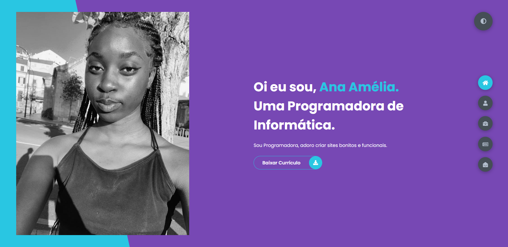

<h1 align="center">Portifólio Webite 💻</h1>

<h4 align="center"><a href="#">Confira o projeto aqui</a></h4>

---

## 💻 Sobre

Projeto feito no intuito de me apresentar, como Programador de Informática.

##  O site é composto por:

- **Home:** Minha apresentação;
- **Sobre mim:** Falo um pouco sobre minha trajetória e meu estado atual;
- **Módulos:** Os modulos que fiz no curso de programador de informatica;
- **Blog:** Eventos realizados pela minha turma e por mim;
- **Fale comigo:** Área com meios para contato comigo;

##  Tecnologias utilizadas:

O site **ainda está em desenvolvimento**, pois estou em constante aprendizado. Mas até aqui utilizei as tecnologias:

    
    
    

---

<table>
  <tr>
    <td>
      
    </td>
    <td>
      Feito por <a href="https://github.com/Anatchissingui">Ana Amélia.</a> 
    </td>
  </tr>
</table>

## 🏆 Licença

The [MIT License](./LICENSE).